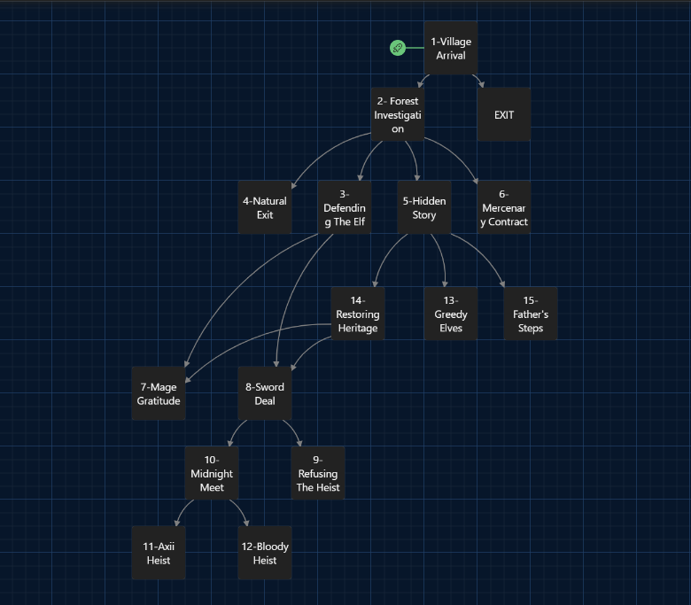

# Quest Design Document: Monsters of Aen'Vaereth

## 1. Project Overview
* **Title:** Monsters of Aen'Vaereth
* **Format:** Interactive Fiction / Narrative RPG
* **Theme:** The moral ambiguity of "The Lesser Evil"

## 2. Narrative Summary
Set in the frozen kingdom of Povis, a Witcher discovers a village thriving with fresh fruit despite a brutal winter. This unnatural abundance is tied to stolen Elven crystals. The player is thrust into a conflict between a human Sergeant, who claims his village is being hunted by monsters, and an Elven Mage, who has summoned cursed hounds to reclaim his people's sacred heritage.

## 3. Design Philosophy
This quest is designed around **Player Agency** and **Moral Gray Areas**:
* **Human Path:** Prioritizes utilitarianism—using the magical pillars to feed a starving village during winter.
* **Elven Path:** Prioritizes cultural heritage and justice over the needs of human settlers.
* **Neutral Path:** Explores the Witcher's philosophy of refusing to choose between two evils, often resulting in chaos for both sides.

## 4. Scene Structure & Logic
The quest is organized by the following node structure as defined in the technical flowchart:

| Scene ID | Narrative Role | Key Outcome |
| :--- | :--- | :--- |
| **Intro** | Village Arrival | Player meets Sergeant Ivar Ruden. |
| **Investigation** | Gameplay/Action | Tracking blood and fighting cursed hounds. |
| **The Choice** | Moral Pivot | Deciding to help the Sergeant, the Mage, or neither. |
| **Soldier Side** | Combat Path | Siding with humans to kill the Mage. |
| **Mage Side** | Branching Path | Siding with the Elf to reclaim the relics. |
| **Stolen Legacy** | Sub-Quest | Dealing with the magical crystals and  taking action to get the Elven King's sword. |
| **Neutral** | Philosophical Exit | Choosing to "choose none" and walking away. |

## 5. Branching Logic Map

## 6. Project Links
* **[🕹️ Play Interactive Version (abridged version)](https://m-wahap-elmali.github.io/quest_design_portfolio/Quest%20Designs/Monsters%20of%20Aen%27Vaereth/)**
* **[📄 Read The Full Narrative Script](./SCRIPT.md)**
* **[📄 Download The Full Narrative Script](./Quest%20Designs/Monsters%20of%20Aen%27Vaereth.pdf)**
* **[📊 Logic Flowchart](./Quest%20Designs/monsters_of_aen_vaereth_branch.png)**
  
---
* **Developed as a portfolio piece for narrative design, originally created for TTRPG.*
* **Created by [M-Wahap-ELMALI]*

